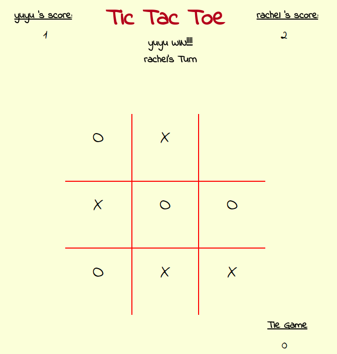
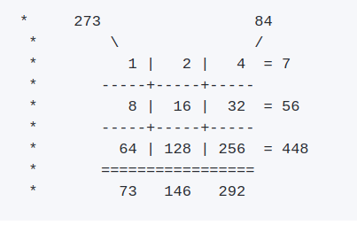

# Tic Tac Toe online game
A simple tic tac toe web game built using HTML, css, JavaScript.I made for fun and do JavaScript practices.

## Current features
1.The window is prompted, insert two players'names before starting the game. At the beginning, the first player represents 'X' and the second player represents 'O'.Start to play! 
2.I implemented click function, I checked the cell is already selected or not. If it is not selected yet, players can click it and move on.  
3.Since I considered the game will be reset. So I thought I keep track of each grid I selected and count the moves.  
4.About who win, I found all win combination(including three horizontal rows, three vertical columns, and two diagonal lines. But here, I thought another smarter way: bi-logic. I got to think that X and O aren't all that different from 1 and 0.Perhaps I could use biwise operator logic to keep track of combination across the board. 

Binary bit weight in decimal(power of 2 exponent)</ br>

* 256 128 64 32 16 8 4 2 1
* --------------------------1 1 1(7)
* --------------------1 0 0 0 0(16)	   
 
when use biwise operation (&) 111 & 10000 = 111 which is winvalue, then this is win combination. 
5.swap O with X players when continuing the new game 

## Future improvement
1.Use MinMax algorithm to optimize our rival-AL  
2.Set up multi-players in this game environment. 

